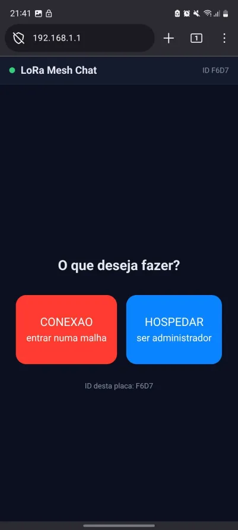
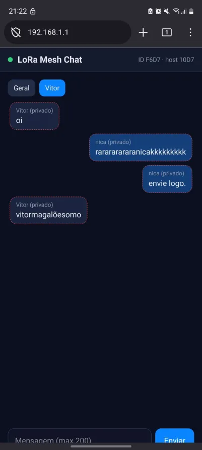
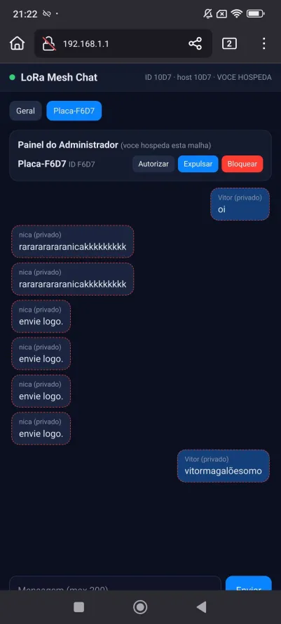

# LoRa Mesh Chat

*[🇧🇷 Português (BR)](README.md) · 🇺🇸 English*

A text chat that works with **no internet, no carrier, and no app**. You power up
the board, join its Wi-Fi from your phone, open a browser, and start talking.
Messages travel over **LoRa radio** from one board to another — the Wi-Fi is only
there to show the screen on your phone.

I started this because I bought a kit of two LoRa boards and the firmware they
shipped with was completely tied to a phone app. I wanted the opposite: power it
on and use it, from any phone, with nothing to install. So I dug up a Wi-Fi chat I
had written years ago for an ESP8266 and rewrote the whole thing for these boards,
swapping the message transport from Wi-Fi over to LoRa.

> It actually works — the screenshots below are two boards talking to each other.

## How it works, in one sentence

The board creates its own Wi-Fi network and serves the pages straight from its
memory. The messages themselves, though, go over LoRa between the boards, forming a
mesh where everyone relays for everyone else.

## Screens

Home screen — pick between joining an existing mesh or becoming the admin:

The chat from a connected client (general chat plus per-board private chats):

Admin panel — whoever hosts can authorize, kick, and block boards:

## What you can do

- General chat, where everyone on the mesh receives.
- Private chat (DM) with a specific board.
- Multiple phones on the same board's Wi-Fi, each with its own name.
- Whoever picks "Host" becomes admin and can authorize, kick, and block.
- Download the conversation history as a `.txt` file.
- Fully offline. No server, no cloud, no sign-up.

## Hardware

Built and tested on the **Heltec WiFi LoRa 32 V3** (ESP32-S3 + SX1262 LoRa radio).
You need **at least two** to have a conversation. Don't forget the antenna —
868 MHz (Europe) or 915 MHz (US) — and plug the antenna in **before** powering the
board, or you risk damaging the radio.

## Installing (Arduino IDE)

1. **ESP32 support:** Tools → Board → Boards Manager → search for `esp32`
   (Espressif) and install.
2. **Select the board:** Tools → Board → `Heltec WiFi LoRa 32(V3)`.
3. **Libraries** (Tools → Manage Libraries):
   - `RadioLib` — by jgromes
   - `ESPAsyncWebServer` — **by mathieucarbou**
   - `AsyncTCP` — **by mathieucarbou**
   - `ArduinoJson` — by bblanchon

   > Important: `ESPAsyncWebServer` and `AsyncTCP` **must both be the mathieucarbou
   > ones**. Mixing versions from different authors throws an annoying compile
   > error (`discards qualifiers`). If that happens, delete both folders in
   > `Arduino/libraries/` and reinstall the mathieucarbou ones.

4. **Frequency:** default is 868 MHz. In the US, change `LORA_FREQ` to `915.0` near
   the top of the `.ino`.
5. Open `LoRaMeshChat.ino`, pick the port, and hit **Upload**.
6. Repeat for the second board. **Nothing to change** — each board derives its own
   ID from its serial number.

## Using it

1. On your phone, join the `LoRaMesh-XXXX` Wi-Fi. Password: `Zeus6996`.
2. Open `http://192.168.1.1`.
3. On one board pick **Host**, on the other pick **Connect**.
4. In "Connect", wait for the other board to show up in the list and tap
   **Connect**.
5. Enter a name and start chatting.

> The password and network name live at the top of the `.ino` — change them if you
> like.

## Why LoRa has no "network list" like Wi-Fi

With Wi-Fi you see networks because they keep advertising themselves. LoRa doesn't
do that out of the box. To get around it, each board sends a small **beacon** (an
"I'm here" ping) every few seconds. When you tap "Connect", the board listens for
those beacons for a few seconds and lists whoever answered. That's what makes it
plug and play.

## About the "admin"

A LoRa mesh has no mandatory central server — every board talks to every board.
Whoever "hosts" is the **moderator**: authorize, kick, block. Messages still reach
everyone even if the host is far away, because boards relay through each other
(flood with a hop limit). If two boards try to host at the same time, **the one
that claimed it first wins** and the other steps down on its own.

## Things I'm not going to hide from you

- LoRa is **slow and low-bandwidth**. Great for short text. Don't expect to send
  photos or huge messages.
- History lives in RAM (around 120 messages). Reboot the board and history is
  gone — that's why the download button exists.
- **Battery won't last days** with this, and the reason is the Wi-Fi being on the
  whole time (that's the power hog, not LoRa). On an 1100 mAh battery, expect a few
  hours of active use. You can improve this a lot by sleeping the board and only
  waking Wi-Fi on demand, but that changes the "always reachable" behavior.
- The OLED ships **off on purpose** to save power. To turn it back on, set
  `USE_OLED` to `1` and install the `U8g2` library.

## Ideas if you want to tinker

- On-demand Wi-Fi (board sleeps, a button wakes it) to stretch the battery.
- Save history to flash so it survives a reboot.
- Over-the-air message encryption.
- Delivery acknowledgement (ACK) and retries.

## License

MIT. Use it, change it, do whatever. If you make it better, send a PR. :)
